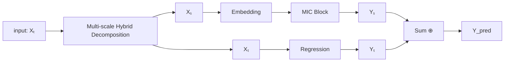

# 📌 MICN – Experimentos de Forecasting (ETT Dataset)

Este repositorio implementa y entrena el modelo **Multi‑scale Isometric Convolution Network (MICN)** para pronóstico de series de tiempo de horizonte largo (LTSF) usando PyTorch.  
Incluye integración con **MLflow** para el tracking de experimentos.

---

## ⚙️ Instalación

1. **Clonar el repositorio**

```bash
git clone https://github.com/tu_usuario/micn-experiments.git
cd micn-experiments
```

2. **Crear y activar un entorno virtual (recomendado)**

```bash
python3 -m venv venv
source venv/bin/activate   # macOS / Linux
# .\venv\Scripts\activate  # Windows
```

3. **Instalar dependencias**

```bash
pip install -r requirements.txt
```

> 📌 Asegúrate de tener instalada la versión de PyTorch con soporte para **MPS** en Mac (Metal Performance Shaders).  
> Para verificar:
> ```python
> import torch
> print(torch.backends.mps.is_available())
> ```

---

## 🚀 Uso de MLflow

Este proyecto utiliza **MLflow** para registrar parámetros, métricas y artefactos.

### 1️⃣ Instalar MLflow

```bash
pip install mlflow
```

### 2️⃣ Levantar el servidor local de MLflow

Desde la raíz del proyecto:

```bash
mlflow ui --backend-store-uri sqlite:///mlflow.db --default-artifact-root ./mlruns
```

Esto levantará la interfaz web en [http://127.0.0.1:5000](http://127.0.0.1:5000)

> Puedes cambiar el puerto con `--port 8080` si lo necesitas:
> ```bash
> mlflow ui --port 8080
> ```

El código del trainer ya tiene configurado:

```python
mlflow.set_tracking_uri("http://127.0.0.1:5000")
```

Así que los experimentos se loguearán automáticamente al servidor local.

---

## 🧠 Arquitectura del Modelo MICN

El modelo **MICN (Multi-scale Isometric Convolution Network)** es una arquitectura diseñada específicamente para el pronóstico de series temporales de horizonte largo (**LTSF**), donde los modelos tradicionales (como LSTM o Transformer) suelen degradar su rendimiento debido a la dificultad de capturar patrones globales y multiescala.

MICN propone una arquitectura basada enteramente en **convoluciones isométricas** para extraer características de manera eficiente a diferentes escalas temporales.

### ✨ Motivación del diseño

- Los métodos autoregresivos propagan errores paso a paso en LTSF.
- Los modelos recurrentes como LSTM son difíciles de paralelizar y tienen problemas con dependencias largas.
- Los Transformers son potentes, pero costosos y no necesariamente eficaces para series altamente estructuradas y estacionarias.

### 🧩 Componentes del MICN



### 🔍 Descripción de cada componente:

- **Input Series X (t):**  
  Serie temporal univariada u multivariada (en este caso la variable "OT") dividida en ventanas de longitud fija (`input_len`).  

- **Embedding Layer:**  
  Aplica una capa lineal o convolucional que proyecta la entrada a un espacio latente de dimensión `d_model`, común a todas las escalas.

- **Multi-scale Isometric Convolution Blocks:**  
  Cada bloque aplica convoluciones con diferentes `kernel sizes` (por ejemplo: 12, 24, 48) pero con **padding isométrico**, lo que garantiza que la salida conserve la misma longitud temporal.  
  Esto permite capturar **patrones locales y globales** sin pérdida de alineación temporal.  
  Además, evita el uso de pooling o dilated convolutions, lo cual reduce complejidad y artefactos.

- **Feature Aggregation:**  
  Las salidas de cada bloque de escala se combinan (por suma, concatenación o atención) para formar una representación rica multiescala.

- **Decoder Layer:**  
  Una o más capas lineales que proyectan la representación agregada hacia el horizonte de salida `output_len`.

- **Forecast Y (t+h):**  
  Salida final: predicción multihorizonte de la serie a futuro.

### 📈 Ventajas de MICN

- Completamente convolucional → altamente paralelizable.
- Multi‑scale design → captura patrones en diferentes frecuencias.
- Isometric design → mantiene alineación temporal sin distorsiones.
- Menor cantidad de parámetros que arquitecturas tipo Transformer.
- Excelente rendimiento en datasets ETTh/ETTm con bajo error (MAE/MSE).

---

## 📂 Arquitectura del Repositorio

```
micn-experiments/
├─ experiments/
│  ├─ trainer.py           # Entrenamiento y evaluación del modelo
│
├─ micn/
│  ├─ __init__.py
│  ├─ MICNModel.py         # Implementación del modelo MICN
│
├─ utils/
│  ├─ windowing.py         # Funciones para crear ventanas y splits
│  ├─ metrics.py           # Métricas MSE, MAE
│
├─ data/
│  ├─ ETTh1.csv            # Dataset (ejemplo)
│  ├─ ETTh2.csv
│  ├─ ...
│
├─ requirements.txt
├─ README.md
└─ mlruns/                 # Carpeta generada por MLflow con los experimentos
```

---

## 📝 Ejecución del Experimento

```bash
python experiments/trainer.py
```

En tu script puedes definir parámetros como:

```python
params = {
  "dataset": "ETTh1",
  "input_len": 96,
  "output_len": 24,
  "d_model": 64,
  "n_layers": 2,
  "scales": (12,24,48),
  "batch_size": 32,
  "epochs": 10,
  "learning_rate": 0.001
}
```
