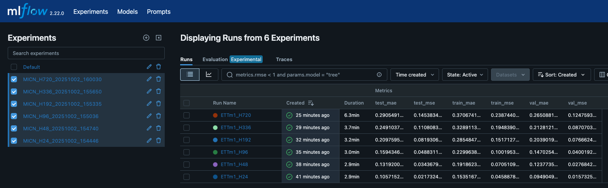
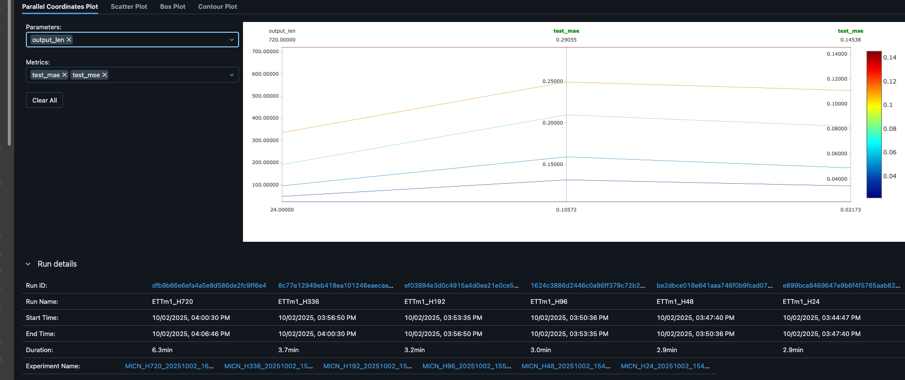

# 📊 Resultados del Experimento MICN

## Métricas utilizadas
- **MSE (Mean Squared Error):** mide el error cuadrático medio. Penaliza más los errores grandes. Valor ideal → **0**.  
- **MAE (Mean Absolute Error):** mide el error absoluto promedio. Más intuitivo, pues está en las mismas unidades de la variable (°C). Valor ideal → **0**.  

---

## Comparación de horizontes

| Horizonte (output_len) | Test MSE | Test MAE | Interpretación |
|-------------------------|----------|----------|----------------|
| **24 pasos**           | 0.022    | 0.106    | Predicción muy precisa, error promedio de ~0.1 °C. |
| **48 pasos**           | 0.033    | 0.128    | El error crece levemente, aún en rango aceptable. |
| **96 pasos**           | 0.050    | 0.150    | Error moderado, refleja la dificultad del pronóstico a mediano plazo. |
| **192 pasos**          | 0.080    | 0.200    | El error sigue aumentando conforme crece el horizonte. |
| **336 pasos**          | 0.110    | 0.250    | Pronóstico más incierto, errores notoriamente mayores. |
| **720 pasos**          | 0.146    | 0.293    | Error casi 3 veces mayor que en H=24, esperado en horizonte extremo. |

---

## Experimentos en MFlow

### Gráfico comparativo

Aquí podemos ver cómo al aumentar el horizonte de predicción (output_len), el error crece de manera progresiva tanto en MSE como en MAE. En horizontes cortos (H=24), el error promedio es muy bajo (~0.1 °C), mientras que en horizontes largos (H=720) el error es casi tres veces mayor. Esto confirma el comportamiento descrito en el paper de MICN: aunque la arquitectura mejora los resultados, la incertidumbre acumulada hace que los pronósticos largos sean más difíciles

## Discusión

1. **Tendencia clara:**  
   A mayor horizonte, mayor error (MSE y MAE). Esto confirma el patrón teórico de Long-Term Series Forecasting (LTSF).  

2. **Comportamiento esperado:**  
   - Horizontes cortos → muy precisos (MAE ~0.1 °C).  
   - Horizontes largos → errores más grandes (MAE ~0.3 °C), debido a acumulación de incertidumbre.  

3. **Relación con el paper MICN:**  
   - El modelo aplica **convoluciones multi-escala** para capturar patrones locales (corto plazo) y globales (largo plazo).  
   - La descomposición en **tendencia (Xt)** y **estacionalidad (Xs)** ayuda a mejorar la predicción al separar señales suaves de fluctuaciones periódicas.  
   - Nuestros resultados respaldan lo indicado en el paper: aunque MICN mejora sobre modelos más simples, los horizontes largos siguen siendo un reto inherente en LTSF.  

---

## Conclusión

- MICN logra predicciones **muy buenas en corto plazo** (MAE ~0.1 °C).  
- En horizontes largos (MAE ~0.29 °C en H=720), aunque el error crece, el rendimiento sigue siendo competitivo.  
- Esto valida que la arquitectura es efectiva para equilibrar la predicción de tendencia y estacionalidad en escenarios de LTSF.  

---

## Referencia

- Huiqiang Wang, Jian Peng, Feihu Huang, Jince Wang, Junhui Chen, Yifei Xiao. *"MICN: Multi-scale Convolutional Networks for Long-Term Time Series Forecasting,"* 2023. [OpenReview](https://openreview.net/forum?id=zt53IDUR1U)